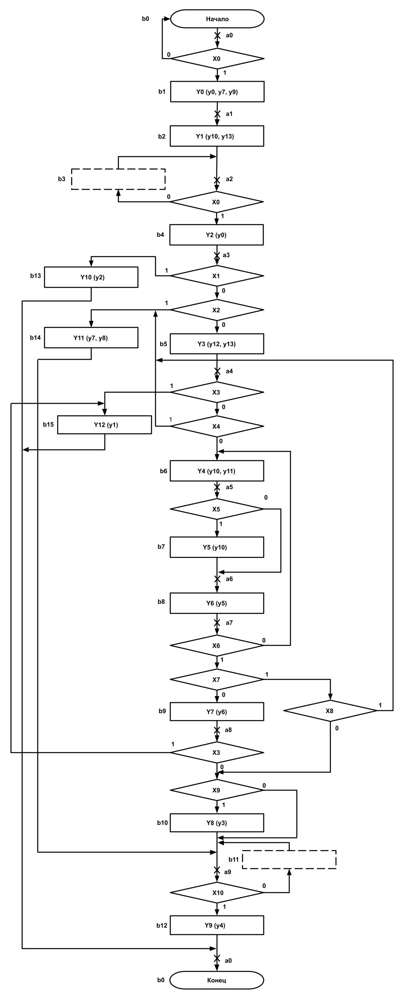
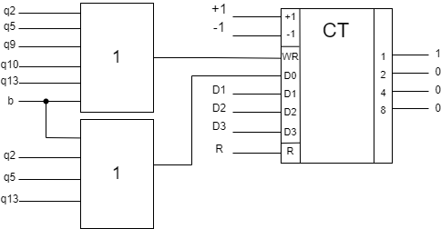

# Floating point divider
Цифровое устройство для деления чисел с плавающей запятой, первым способом с восстановлением остатка с порядками в прямом коде; при вычитании мантисс используется обратный код.  
Проект демонстрирует полный цикл разработки цифровых устройств: постановка задачи, разработка алгоритма, синтез операционного и управляющего автомата, реализация и тестирование устройства.

A digital device for floating-point division, using the restoring division method with exponents in direct code; subtraction of mantissas is performed in one’s complement code.  
The project demonstrates the full cycle of digital device development: problem statement, algorithm design, synthesis of the datapath and control automaton, implementation, and testing.

## Contents
- [Features](#features--возможности)
- [Project structure](#структура-проекта--project-structure)
- [Usage](#usage--использование)
- [Technologies](#technologies--технологии)
- [Output](#output--вывод)
- [Documentation](#technical-documentation--техническая-документация)
- [License](#license)

## Features / Возможности

### Русский
- Обработка всех видов исключительных ситуаций
    - Деление на ноль
    - Деление нуля
    - Переполнение разрядной сетки (ПРС)
    - Потеря младших разрядов (ПМР)
- Разработанный алгоритм деления позволяет выполнять сложение в обратном коде за один такт, что обеспечивает повышение быстродействия на 30%, но повышает погрешность вычисления до 1% в худщем случае, по сравнению со стандартым алгоритмом
- Проведена оптимизация управляющего автомата. Полученный вариант обладает ценой по Квайну на 12% больше минимальной, но выигрывает в быстродействии  еще на 28% в худшем случае.
- Устройство реализовано и протестировано в САПР Quartus II

### English
- Handles all exceptional cases:
  - Division by zero
  - Division of zero
  - Exponent grid overflow (EGO)
  - Loss of least significant digits (LLD)
- The developed division algorithm performs one’s complement addition in a single clock cycle, which increases performance by 30% but introduces up to 1% error in the worst case compared to the standard algorithm.
- Optimization of the control automaton was performed. The resulting design is 12% more expensive (by Quine’s cost metric) than the minimum but achieves up to 28% better performance in the worst case.
- The device was implemented and tested in Quartus II.


## Структура проекта / Project structure
```
floating_point_divider/
├── quartus_project/                        # проект устройства
|    ├── OA.qpf                             # проект САПР Quartus II
|    ├── OA.bsf                             # операционная часть устройства
|    └── UA.bsf                             # управляющая часть устройства
├── images/                                 # ресурсы изображений
├── examples/                               # примеры работы устройства (полные таблицы выходных сигналов во времени)
|    ├── EGO.tbl                            # ПРС при вычитании порядков
|    ├── EGO_after normalization.tbl        # ПРС при увеличении порядка после нормализации
|    ├── removable_LLD.tbl                  # временное ПМР (неустранимое)
|    ├── true_LLD.tbl                       # истинная ПМР
|    ├── unremovable_LLD.tbl                # временное ПМР (устранимое)
|    ├── without_exceptions_1.tbl           # пример без исключительных ситуаций 1
|    ├── without_exceptions_2.tbl           # пример без исключительных ситуаций 2
|    └── without_exceptions_3.tbl           # пример без исключительных ситуаций 3
└── documentation.pdf                       # расширенная документация
```

## Usage / Использование

### Русский
Запуск симуляции
1. Откройте проект `OA.qpf` в САПР Quartus II
2. Скомпилируйте проект
3. Сгенерируйте Functional Simulation Netlist со своими входными данными
4. Запустите симуляцию

Просмотр примеров:
1. Откройте любой `.tbl` из папки `examples` в Quartus II или другой CAD-системе.

### English
Running a simulation:
1. Open the project `OA.qpf` in Quartus II.
2. Compile the project
3. Generate a Functional Simulation Netlist with your input data.  
4. Start the simulation.  

Viewing examples:
1. Open any `.tbl` file from the `examples` folder in Quartus II or a similar CAD tool.

## Technologies / Технологии
- Verilog / VHDL
- Altera Quartus II Version 9.1

## Output / Вывод
1. ПРС при вычитании порядков / EGO when subtracting exponents  
Dividend: 0 0 1100 1111110000  
Divisor: 0 1 0110 1010010000  
Result: EGO / ПРС  

2. ПРС при увеличении порядка после нормализации / EGO after normalization increment  
Dividend: 0 0 1100 1111110000  
Divisor: 0 1 0011 1000000000  
Result: EGO / ПРС  

3. временное ПМР (неустранимое) / temporary LLD (unremovable)  
Dividend: 1 1 0101 1000000000  
Divisor: 0 0 1011 1111110000  
Result: 0 0 0000 0000000000  

4. истинная ПМР / true LLD  
Dividend: 0 1 0110 1111110000  
Divisor: 0 0 1100 1010010000  
Result: 0 0 0000 0000000000  

5. временное ПМР (устранимое) / temporary LLD (removable)  
Dividend: 1 1 0101 1111110000  
Divisor: 0 0 1011 1000000000  
Result: 1 1 1111 11111101111 = -0.00003026  
Exact: -0.000030039  
Relative error: 0.7%  

6. пример без исключительных ситуаций 1 / example without exceptions 1  
Dividend: 1 0 0101 1000000000  
Divisor: 0 0 0101 1111110000  
Result: 1 0 0000 10000001111 = -0.50732422  
Exact: -0.505  
Relative error: 0.4%  

7. пример без исключительных ситуаций 2 / example without exceptions 2  
Dividend: 0 0 0110 1101000000  
Divisor: 0 0 0110 1110000000  
Result: 0 0 0000 1110110101 = 0.92675781  
Exact: 0.92857  
Relative error: 0.1%  

8. пример без исключительных ситуаций 3 / example without exceptions 3  
Dividend: 0 0 0010 1111110000  
Divisor: 0 0 0011 1000000000  
Result: 0 0 0000 1111101111 = 0.98339844  
Exact: 0.98437  
Relative error: 0.09%  

## Technical documentation / Техническая документация
Функциональная схема операционного устройства / Functional scheme of operational device


Содержательная граф-схема алгоритма деления / Division algorithm graph scheme


Граф функционирования управляющего устройства / Functional scheme of control device


Отмеченная граф-схема алгоритма деления / Marked division algorithm graph scheme


Функциональная схема управляющего устройства  / Functional scheme of control device




Более подробное описание устройства и принципа его работы можно найти в расширенной документации (файл `documentation.pdf`). / A more detailed description of the device and its operating principle can be found in the extended documentation (`documentation.pdf`).

## License
This project is licensed under the MIT License – see the LICENSE file for details.